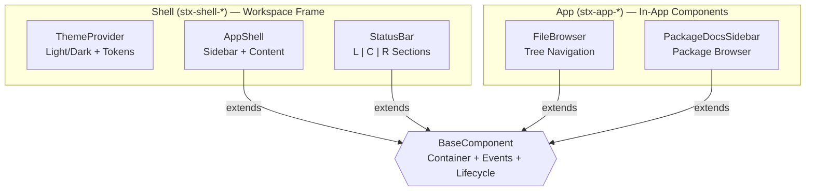

# SciTeX UI (<code>scitex-ui</code>)

<p align="center">
  <a href="https://scitex.ai">
    
  </a>
</p>

<p align="center">
  <a href="https://scitex-ui.readthedocs.io/">Full Documentation</a> · <code>uv pip install scitex-ui[all]</code>
</p>

<!-- scitex-badges:start -->
<p align="center">
  <a href="https://pypi.org/project/scitex-ui/"></a>
  <a href="https://pypi.org/project/scitex-ui/"></a>
  <a href="https://github.com/ywatanabe1989/scitex-ui/actions/workflows/test.yml"></a>
  <a href="https://github.com/ywatanabe1989/scitex-ui/actions/workflows/install-test.yml"></a>
  <a href="https://codecov.io/gh/ywatanabe1989/scitex-ui"></a>
  <a href="https://scitex-ui.readthedocs.io/en/latest/"></a>
  <a href="https://www.gnu.org/licenses/agpl-3.0"></a>
</p>
<!-- scitex-badges:end -->

---

## Problem and Solution

| # | Problem | Solution |
|---|---------|----------|
| 1 | **Every scitex workspace app duplicates panel-resize / design-tokens / React hooks** -- drift + copy-paste | **Shared shell framework** -- vanilla TS `initShell` as single source of truth; React `usePanelResize` / `DataTable` as optional app components; CSS design tokens shared via Django static |
| 2 | **Live UI introspection means writing custom Playwright scripts** -- common enough to deserve tooling | **MCP `ui_inspect_element(selector)`** -- bbox, computed styles, text, attrs — for agent-driven UI debugging |

## Architecture

Each component ships with:
- **TypeScript source** — framework-agnostic, vanilla DOM API
- **CSS styles** — scoped via BEM-like class prefixes (`stx-shell-*`, `stx-app-*`)
- **Python metadata** — version, file paths, descriptions



<p align="center"><sub><b>Figure 1.</b> Component architecture. Shell components provide workspace framing (theme, layout, status bar). App components are reusable in-app widgets. All extend BaseComponent for shared container resolution, event dispatch, and lifecycle management.</sub></p>

### Current Components

| Category | Component | Prefix | Description |
|----------|-----------|--------|-------------|
| Shell | **ThemeProvider** | `stx-shell-` | Light/dark theme manager with semantic color tokens |
| Shell | **AppShell** | `stx-shell-` | Workspace layout with collapsible sidebar and accent colors |
| Shell | **StatusBar** | `stx-shell-` | Bottom status bar with left/center/right sections |
| App | **FileBrowser** | `stx-app-` | Tree view for navigating file hierarchies |
| App | **PackageDocsSidebar** | `stx-app-` | Navigable sidebar for Python package documentation |

<p align="center"><sub><b>Table 1.</b> Available UI components. Shell components provide workspace framing; App components are for in-app use. Each is registered in the Python metadata registry.</sub></p>

## Installation

Requires Python >= 3.10.

```bash
pip install scitex-ui
```

## Quick Start

### Django Setup

Add `scitex_ui` to your `INSTALLED_APPS`:

```python
INSTALLED_APPS = [
    # ...
    "scitex_ui",
]
```

Static assets are automatically discoverable by Django's `AppDirectoriesFinder`.

### Python API

```python
import scitex_ui

# List all registered components
for name in scitex_ui.list_components():
    meta = scitex_ui.get_component(name)
    print(f"{name} v{meta.version} — {meta.description}")

# Get specific component metadata
sidebar = scitex_ui.get_component("package-docs-sidebar")
print(sidebar.ts_entry)   # TypeScript entry point
print(sidebar.css_file)   # CSS stylesheet path
```

### TypeScript Usage

```typescript
// Workspace shell
import { ThemeProvider } from "scitex_ui/ts/shell/theme-provider";
import { AppShell } from "scitex_ui/ts/shell/app-shell";
import { StatusBar } from "scitex_ui/ts/shell/status-bar";

const theme = new ThemeProvider();
const shell = new AppShell({
  container: "#app",
  accent: "writer",        // Preset accent color
  collapsible: true,
});
const statusBar = new StatusBar({ container: "#status" });

// In-app components
import { FileBrowser } from "scitex_ui/ts/app/file-browser";

const browser = new FileBrowser({
  container: "#files",
  onFileSelect: (node) => console.log(node.path),
});
```

## Three Interfaces

<details open>
<summary><b>Python API</b></summary>

| Function | Description |
|----------|-------------|
| `list_components()` | List all registered component names |
| `get_component(name)` | Get metadata for a registered component |
| `register_component(name, metadata)` | Register a new component |

</details>

<details>
<summary><b>CLI Commands</b> <i>(planned)</i></summary>

```bash
scitex-ui --help              # Show help
scitex-ui list-components     # List registered components
scitex-ui version             # Show version
```

</details>

<details>
<summary><b>MCP Server</b> <i>(planned)</i></summary>

MCP (Model Context Protocol) tools for AI agents to discover and query available UI components.

</details>

## Demo

The package ships runnable example pages under `examples/` showing each component category in isolation:

| Example | What it shows |
|---------|---------------|
| **`01_list_components.py`** | Iterates the registry: prints every Shell + App component with its version, TS entry, and CSS path |
| **`02_workspace_components.py`** | Mounts `ThemeProvider` + `AppShell` + `StatusBar` as a minimal workspace frame |

```mermaid
flowchart LR
    subgraph Page ["Browser Page (#app)"]
        Theme[ThemeProvider<br/>tokens injected]
        Shell[AppShell<br/>sidebar + content]
        Bar[StatusBar<br/>L | C | R]
        FB[FileBrowser<br/>tree view]
    end
    Static[Django static<br/>scitex_ui/static/] --> Page
    Reg[(Python registry<br/>get_component)] --> Static
    style Theme fill:#4a90d9,stroke:#2c3e50,color:#fff
    style Shell fill:#4a90d9,stroke:#2c3e50,color:#fff
    style Bar  fill:#4a90d9,stroke:#2c3e50,color:#fff
    style FB   fill:#27ae60,stroke:#2c3e50,color:#fff
```

<p align="center"><sub><b>Figure 2.</b> Demo. Components are discovered via the Python registry, then mounted in TypeScript against DOM containers. CSS is shipped as Django static assets.</sub></p>

```bash
# List every registered component
python examples/01_list_components.py

# Run the workspace-shell example (Django dev server)
python examples/02_workspace_components.py
# → open http://localhost:8000/ to see ThemeProvider + AppShell + StatusBar
```

## Role in SciTeX Ecosystem

`scitex-ui` is the **shared TypeScript + CSS component library** for all SciTeX web applications. It provides the visual building blocks that maintain consistency across the cloud dashboard, workspace editor, and third-party apps.

```
scitex (orchestrator, templates, CLI, MCP)
  |-- scitex-app              -- runtime SDK for apps
  |-- scitex-ui (this package) -- TS + CSS component library
  |     |-- Shell (stx-shell-*) -- ThemeProvider, AppShell, StatusBar
  |     |-- App (stx-app-*)     -- FileBrowser, PackageDocsSidebar
  |     +-- Design tokens        -- spacing, typography, z-index, colors
  +-- figrecipe                -- reference app (consumes scitex-ui)
```

**What this package owns:**

- Shell components (`stx-shell-*`): ThemeProvider, AppShell, StatusBar
- App components (`stx-app-*`): FileBrowser, PackageDocsSidebar
- Design token CSS: theme colors, spacing, typography, z-index primitives

**What this package does NOT own:**

- Backend/runtime SDK -- see [scitex-app](https://github.com/ywatanabe1989/scitex-app)
- Orchestration, templates, CLI -- see [scitex](https://github.com/ywatanabe1989/scitex-python)
- App-specific logic -- each app (e.g., [figrecipe](https://github.com/ywatanabe1989/figrecipe)) owns its own views

## Part of SciTeX

`scitex-ui` is part of [**SciTeX**](https://scitex.ai). Install via
the umbrella with `pip install scitex[ui]` to use as
`scitex.ui` (Python) or `scitex ui ...` (CLI).

>Four Freedoms for Research
>
>0. The freedom to **run** your research anywhere — your machine, your terms.
>1. The freedom to **study** how every step works — from raw data to final manuscript.
>2. The freedom to **redistribute** your workflows, not just your papers.
>3. The freedom to **modify** any module and share improvements with the community.
>
>AGPL-3.0 — because we believe research infrastructure deserves the same freedoms as the software it runs on.

---

<p align="center">
  <a href="https://scitex.ai">
    
  </a>
</p>
