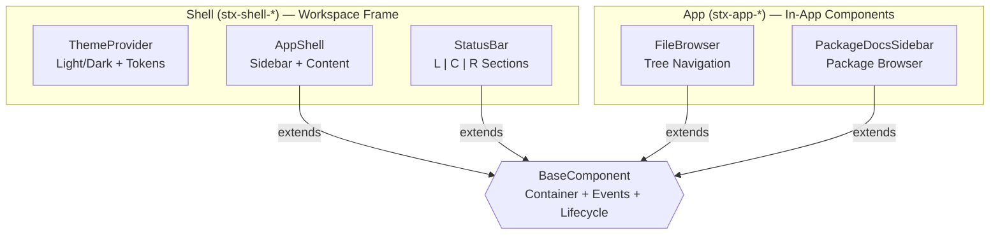

# SciTeX UI (<code>scitex-ui</code>)

<p align="center">
  <a href="https://scitex.ai">
    
  </a>
</p>

<p align="center"><b>Shared frontend UI components for the SciTeX ecosystem</b></p>

<p align="center">
  <a href="https://badge.fury.io/py/scitex-ui"></a>
  <a href="https://scitex-ui.readthedocs.io/"></a>
  <a href="https://github.com/ywatanabe1989/scitex-ui/actions/workflows/test.yml"></a>
  <a href="https://www.gnu.org/licenses/agpl-3.0"></a>
</p>

<p align="center">
  <a href="https://scitex-ui.readthedocs.io/">Full Documentation</a> · <code>pip install scitex-ui</code>
</p>

---

## Problem

The SciTeX ecosystem comprises multiple web applications (cloud dashboard, documentation hub, workspace editor) that share common frontend patterns — navigation sidebars, package browsers, status indicators. Without a shared component library, each application re-implements these patterns independently, leading to visual inconsistency and duplicated effort.

## Solution

SciTeX UI provides a library of reusable TypeScript + CSS components designed for SciTeX web applications. Components are packaged as a Django app with static assets discoverable via `AppDirectoriesFinder`, and a Python registry for component metadata.

Each component ships with:
- **TypeScript source** — framework-agnostic, vanilla DOM API
- **CSS styles** — scoped via BEM-like class prefixes (`stx-shell-*`, `stx-app-*`)
- **Python metadata** — version, file paths, descriptions

### Architecture



<p align="center"><sub><b>Figure 1.</b> Component architecture. Shell components provide workspace framing (theme, layout, status bar). App components are reusable in-app widgets. All extend BaseComponent for shared container resolution, event dispatch, and lifecycle management.</sub></p>

### Current Components

| Category | Component | Prefix | Description |
|----------|-----------|--------|-------------|
| Shell | **ThemeProvider** | `stx-shell-` | Light/dark theme manager with semantic color tokens |
| Shell | **AppShell** | `stx-shell-` | Workspace layout with collapsible sidebar and accent colors |
| Shell | **StatusBar** | `stx-shell-` | Bottom status bar with left/center/right sections |
| App | **FileBrowser** | `stx-app-` | Tree view for navigating file hierarchies |
| App | **PackageDocsSidebar** | `stx-app-` | Navigable sidebar for Python package documentation |

<p align="center"><sub><b>Table 1.</b> Available UI components. Shell components provide workspace framing; App components are for in-app use. Each is registered in the Python metadata registry.</sub></p>

## Installation

Requires Python >= 3.10.

```bash
pip install scitex-ui
```

## Quick Start

### Django Setup

Add `scitex_ui` to your `INSTALLED_APPS`:

```python
INSTALLED_APPS = [
    # ...
    "scitex_ui",
]
```

Static assets are automatically discoverable by Django's `AppDirectoriesFinder`.

### Python API

```python
import scitex_ui

# List all registered components
for name in scitex_ui.list_components():
    meta = scitex_ui.get_component(name)
    print(f"{name} v{meta.version} — {meta.description}")

# Get specific component metadata
sidebar = scitex_ui.get_component("package-docs-sidebar")
print(sidebar.ts_entry)   # TypeScript entry point
print(sidebar.css_file)   # CSS stylesheet path
```

### TypeScript Usage

```typescript
// Workspace shell
import { ThemeProvider } from "scitex_ui/ts/shell/theme-provider";
import { AppShell } from "scitex_ui/ts/shell/app-shell";
import { StatusBar } from "scitex_ui/ts/shell/status-bar";

const theme = new ThemeProvider();
const shell = new AppShell({
  container: "#app",
  accent: "writer",        // Preset accent color
  collapsible: true,
});
const statusBar = new StatusBar({ container: "#status" });

// In-app components
import { FileBrowser } from "scitex_ui/ts/app/file-browser";

const browser = new FileBrowser({
  container: "#files",
  onFileSelect: (node) => console.log(node.path),
});
```

## Three Interfaces

<details>
<summary><b>Python API</b></summary>

| Function | Description |
|----------|-------------|
| `list_components()` | List all registered component names |
| `get_component(name)` | Get metadata for a registered component |
| `register_component(name, metadata)` | Register a new component |

</details>

<details>
<summary><b>CLI Commands</b> <i>(planned)</i></summary>

```bash
scitex-ui --help              # Show help
scitex-ui list-components     # List registered components
scitex-ui version             # Show version
```

</details>

<details>
<summary><b>MCP Server</b> <i>(planned)</i></summary>

MCP (Model Context Protocol) tools for AI agents to discover and query available UI components.

</details>

## Part of SciTeX

`scitex-ui` is part of [SciTeX](https://scitex.ai). When used within the SciTeX ecosystem, components automatically integrate with the SciTeX cloud dashboard and documentation hub.

The SciTeX ecosystem follows the **Four Freedoms for researchers**, inspired by [the Free Software Definition](https://www.gnu.org/philosophy/free-sw.en.html):

- **Freedom 0** — Run the software for any research purpose.
- **Freedom 1** — Study how the software works and adapt it to your needs.
- **Freedom 2** — Redistribute copies to help fellow researchers.
- **Freedom 3** — Distribute modified versions so the community benefits.

---

<p align="center">
  <a href="https://scitex.ai">
    
  </a>
</p>
